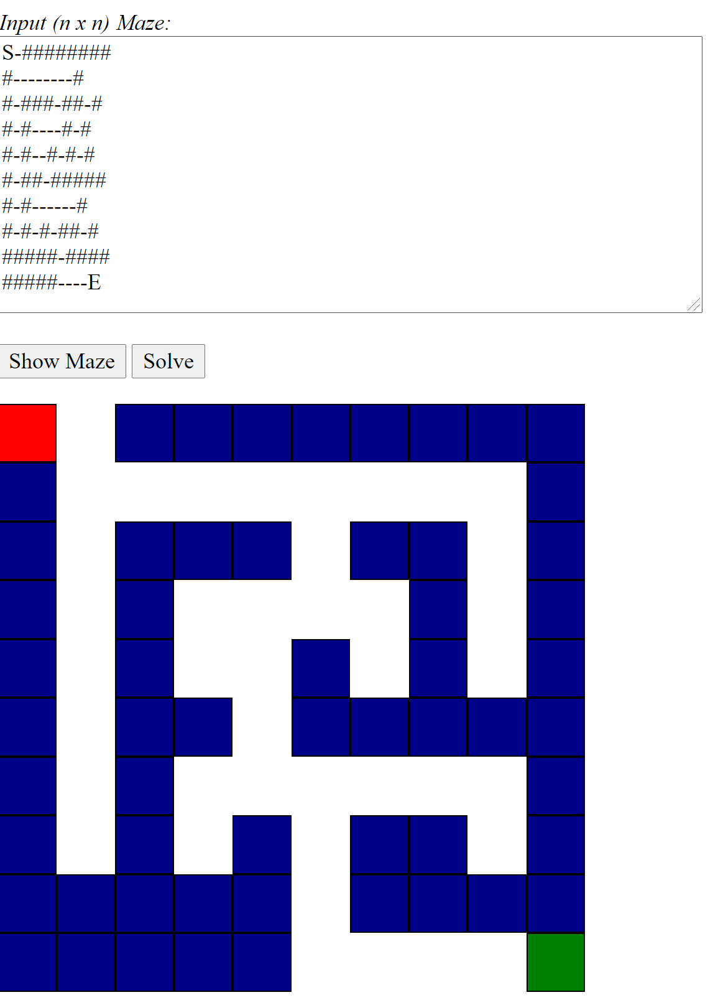
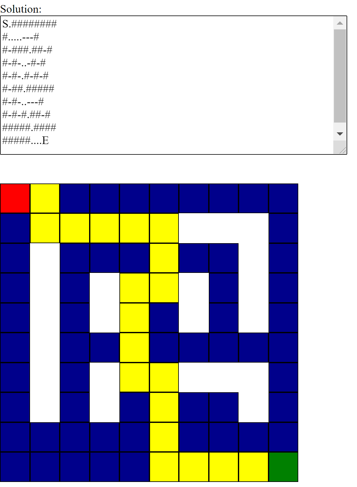

# Maze Traversal

## Prerequisites

* Java 8
* Spring Boot 2.3.10
* Apache Maven 3.6

## Usage

* Package the maze-traversal-api using Maven: 
  ```maven
  mvn clean package
  ```

* Run .jar in JARs folder or generated .jar file as Java application:
  ```cmd
  java -jar maze-traversal-api-0.0.1-SNAPSHOT.jar
  ```

## Solution
I went with depth-first search as my algorithm for traversing the _n x n_ maze.

_**Depth-First Search:**_ Depth-first search is a recursive algorithm for traversing a tree or graph data structure.
It is so called because it starts from the root node and follows each path to its greatest depth node before moving to the next path.

The advantage of DFS is that it's fast and the memory access patterns involved in running DFS (maintaining the top of a stack and probing places near the most-recently-visited spot) plays well with caches. DFS has an advantage over A*, in the sense that it doesn't have to deal with the associated overhead of maintaining distances in A*. For BFS, probabilistically, start nodes of a maze tend to be at be at the edge of the maze, BFS tends to search outwards from the starting location by exploring paths of progressively longer and longer lengths so a ot of time is spent exploring unnecessary paths.

## Implementation
### Maze
The maze was represented as graph using a two-dimensional (2D) integer array.

_Legend:_
* 0/'-' - Road
* 1/'#' - Wall
* 2/'S' - Start
* 3/'E' - Exit
* 4/'.' - Cell part of the path. i.e. solution path.

This 2D array is passed to the solve() method which returns a list of _Coordinate_ objects. Each _Coordinate_ object represents a node in the graph.

### Algorithm
In this implementation, we brute force the solution of the maze by backtracking and marking visited nodes, to obtain a path.

This algorithm can be outlined as:
* If we're at the wall or an already visited node, return failure.
* Else if we're the exit node, then return success.
* Else, add the node in path list and recursively travel in all four directions. If failure is returned, remove the node from the path and return failure. Path list will contain a unique path when exit is found [[1]](#1).

I defined 2D Array called DIRECTIONS containing a list of nodes, which when added to any _Coordinate_ object would return a neighbouring _Coordinate_ object.

Next, in the solve() method. I specified that if a path from the start to exit node is not found, an exception should be thrown.

Finally, in the explore() method. Nodes outside the maze (invalid nodes), part of the wall, or visited nodes are discarded from the path list.
While the exit is not found, the current node in the recursion sequence is marked as visited. 
And, the method continues to execute recursively until an exit node is found or all nodes in the maze 2D array have been visited.

```java
  private boolean explore(Maze maze, int row, int col, List<Coordinate> path) {
        if (!maze.isValidLocation(row, col) || maze.isWall(row, col) || maze.isExplored(row, col)) {
            return false;
        }

        path.add(new Coordinate(row, col));
        maze.setVisited(row, col, true);

        if (maze.isExit(row, col)) {
            return true;
        }

        for (int[] direction : DIRECTIONS) {
            Coordinate coordinate = getNextCoordinate(row, col, direction[0], direction[1]);
            if (explore(maze, coordinate.getX(), coordinate.getY(), path)) {
                return true;
            }
        }

        path.remove(path.size() - 1);
        return false;
    }
  ```

## Sample

### Input Maze


### Solved Maze


## Contact
Seyi S. Adedara - adedaraseyi@gmail.com

## References
<a id="1">[1]</a> 
J. Deep. 
"A Maze Solver in Java",
Baeldung Blog,
26 July 2020. [Online]
Available: https://www.baeldung.com/java-solve-maze. 
[Accessed 3 June 2021].
